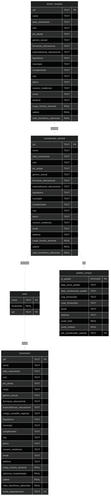

# EMR Diagram

```mermaid
---
config:
  theme: dark
---
erDiagram

diretor_hospital{
    
    cpf TEXT PK
    nome TEXT
    data_nascimento TEXT
    cnis TEXT
    pis_pasep TEXT
    genero_sexual TEXT
    formacao_educacional TEXT
    especializacao_educacional TEXT
    logradouro TEXT
    municipio TEXT
    complemento TEXT
    cep TEXT
    bairro TEXT
    numero_residencia TEXT
    email TEXT
    telefone TEXT
    carga_horaria_semanal REAL
    salario REAL
    valor_beneficios_adicionais REAL
}

coordenador_setorial{
    
    cpf TEXT PK
    nome TEXT
    data_nascimento TEXT
    cnis TEXT
    pis_pasep TEXT
    genero_sexual TEXT
    formacao_educacional TEXT
    especializacao_educacional TEXT
    logradouro TEXT
    municipio TEXT
    complemento TEXT
    cep TEXT
    bairro TEXT
    numero_residencia TEXT
    email TEXT
    telefone TEXT
    carga_horaria_semanal REAL
    salario REAL
    valor_beneficios_adicionais REAL
}


setor{
    nome TEXT PK
    orcamento REAL
    cpf TEXT FK
}

funcionario{
    cpf TEXT PK
    nome TEXT
    data_nascimento TEXT   
    cnis TEXT
    pis_pasep TEXT
    cargo TEXT
    genero_sexual TEXT
    formacao_educacional TEXT
    especializacao_educacional TEXT
    codigo_conselho_regional TEXT
    logradouro TEXT
    municipio TEXT
    complemento TEXT
    cep TEXT
    bairro TEXT
    numero_residencia TEXT
    email TEXT
    telefone TEXT
    carga_horaria_semanal REAL
    adicional_insalubridade REAL
    salario REAL
    valor_beneficios_adicionais REAL
    nome_departamento TEXT FK
}

pedido_compra{
    id_pedido INTEGER PK
    data_envio_pedido TEXT
    data_recebimento_pedido TEXT
    cnpj_fornecedor TEXT
    cnae_fornecedor TEXT
    email TEXT
    telefone TEXT
    custo_total REAL
    custo_unitario REAL
    cpf_coordenador_setorial TEXT FK

}

diretor_hospital ||--|{ coordenador_setorial: Contrata
coordenador_setorial ||--|{ pedido_compra: Faz
coordenador_setorial ||--|| setor: Coordena
setor ||--|{ funcionario: Possui
```