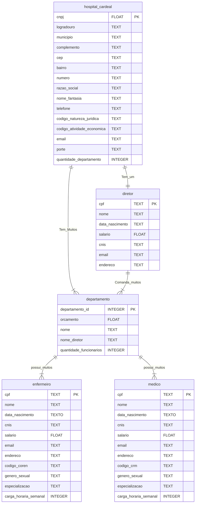

# EMR DIAGRAM

```mermaid
---

---
erDiagram


hospital_cardeal{ 
    
 cnpj FLOAT PK
 logradouro TEXT
 municipio TEXT
 complemento TEXT
 cep TEXT
 bairro TEXT
 numero TEXT
 razao_social TEXT
 nome_fantasia TEXT
 telefone TEXT
 codigo_natureza_juridica TEXT
 codigo_atividade_economica TEXT
 email TEXT
 porte TEXT
 quantidade_departamento INTEGER
 
}


diretor{
		
 cpf TEXT PK
 nome TEXT
 data_nascimento TEXT
 salario FLOAT
 cnis TEXT
 email TEXT
 endereco TEXT
		
}

departamento{
		
 departamento_id INTEGER PK
 orcamento FLOAT
 nome TEXT
 nome_diretor TEXT
 quantidade_funcionarios INTEGER
		
}

medico{
    
 cpf TEXT PK
 nome TEXT
 data_nascimento TEXTO   
 cnis TEXT
 salario FLOAT
 email TEXT
 endereco TEXT
 codigo_crm TEXT
 genero_sexual TEXT
 especializacao TEXT
 carga_horaria_semanal INTEGER
    
}

enfermeiro{ 
 
 cpf TEXT PK
 nome TEXT
 data_nascimento TEXTO   
 cnis TEXT
 salario FLOAT
 email TEXT
 endereco TEXT
 codigo_coren TEXT
 genero_sexual TEXT
 especializacao TEXT
 carga_horaria_semanal INTEGER

}

hospital_cardeal ||--|| diretor: Tem_um
hospital_cardeal ||--|{ departamento: Tem_Muitos
diretor ||--|{ departamento: Comanda_muitos
departamento ||--|{ enfermeiro: possui_muitos
departamento ||--|{ medico: possui_muitos
```