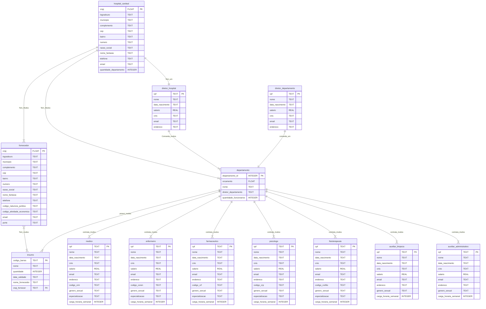

# EMR DIAGRAM

```mermaid
---

---
erDiagram


hospital_cardeal{ 
    
    cnpj FLOAT PK
    logradouro TEXT
    municipio TEXT
    complemento TEXT
    cep TEXT
    bairro TEXT
    numero TEXT
    razao_social TEXT
    nome_fantasia TEXT
    telefone TEXT
    email TEXT
    quantidade_departamento INTEGER
 
}

fornecedor{ 
    
    cnpj FLOAT PK
    logradouro TEXT
    municipio TEXT
    complemento TEXT
    cep TEXT
    bairro TEXT
    numero TEXT
    razao_social TEXT
    nome_fantasia TEXT
    telefone TEXT
    codigo_natureza_juridica TEXT
    codigo_atividade_economica TEXT
    email TEXT
    porte TEXT
 
}

diretor_hospital{
		
    cpf TEXT PK
    nome TEXT
    data_nascimento TEXT
    salario REAL
    cnis TEXT
    email TEXT
    endereco TEXT
		
}

departamento{
		
    departamento_id INTEGER PK
    orcamento FLOAT
    nome TEXT
    diretor_departamento TEXT
    quantidade_funcionarios INTEGER
		
}

diretor_departamento{
    
    cpf TEXT PK
    nome TEXT
    data_nascimento TEXT
    salario REAL
    cnis TEXT
    email TEXT
    endereco TEXT
    
}

medico{
    
    cpf TEXT PK
    nome TEXT
    data_nascimento TEXT   
    cnis TEXT
    salario REAL
    email TEXT
    endereco TEXT
    codigo_crm TEXT
    genero_sexual TEXT
    especializacao TEXT
    carga_horaria_semanal INTEGER
    
}

enfermeiro{ 
 
    cpf TEXT PK
    nome TEXT
    data_nascimento TEXT   
    cnis TEXT
    salario REAL
    email TEXT
    endereco TEXT
    codigo_coren TEXT
    genero_sexual TEXT
    especializacao TEXT
    carga_horaria_semanal INTEGER

}

farmaceutico{ 
 
    cpf TEXT PK
    nome TEXT
    data_nascimento TEXT   
    cnis TEXT
    salario REAL
    email TEXT
    endereco TEXT
    codigo_crf TEXT
    genero_sexual TEXT
    especializacao TEXT
    carga_horaria_semanal INTEGER

}

psicologo{ 
 
    cpf TEXT PK
    nome TEXT
    data_nascimento TEXT   
    cnis TEXT
    salario REAL
    email TEXT
    endereco TEXT
    codigo_crp TEXT
    genero_sexual TEXT
    especializacao TEXT
    carga_horaria_semanal INTEGER

}

fisioterapeuta{ 
 
    cpf TEXT PK
    nome TEXT
    data_nascimento TEXT   
    cnis TEXT
    salario REAL
    email TEXT
    endereco TEXT
    codigo_crefito TEXT
    genero_sexual TEXT
    especializacao TEXT
    carga_horaria_semanal INTEGER

}

auxiliar_limpeza{ 
 
    cpf TEXT PK
    nome TEXT
    data_nascimento TEXT   
    cnis TEXT
    salario REAL
    email TEXT
    endereco TEXT
    genero_sexual TEXT
    carga_horaria_semanal INTEGER

}

auxiliar_administrativo{ 
 
    cpf TEXT PK
    nome TEXT
    data_nascimento TEXT   
    cnis TEXT
    salario REAL
    email TEXT
    endereco TEXT
    genero_sexual TEXT
    carga_horaria_semanal INTEGER

}

insumo{
    
    codigo_barras TEXT PK
    nome TEXT
    quantidade INTEGER
    data_validade TEXT
    nome_fornecedor TEXT
    cnpj_fornecer TEXT FK
}

hospital_cardeal ||--|| diretor_hospital: Tem_um
hospital_cardeal ||--|{ departamento: Tem_Muitos
hospital_cardeal ||--|{ fornecedor: Tem_Muitos
fornecedor }|--|{ insumo: Tem_muitos
diretor_hospital ||--|{ departamento: Comanda_muitos
diretor_departamento ||--|| departamento: comanda_um
departamento ||--|{ insumo: possui_muitos
departamento ||--|{ medico: contrata_muitos
departamento ||--|{ enfermeiro: contrata_muitos
departamento ||--|{ farmaceutico: contrata_muitos
departamento ||--|{ psicologo: contrata_muitos
departamento ||--|{ fisioterapeuta: contrata_muitos
departamento ||--|{ auxiliar_limpeza: contrata_muitos
departamento ||--|{ auxiliar_administrativo: contrata_muitos
```