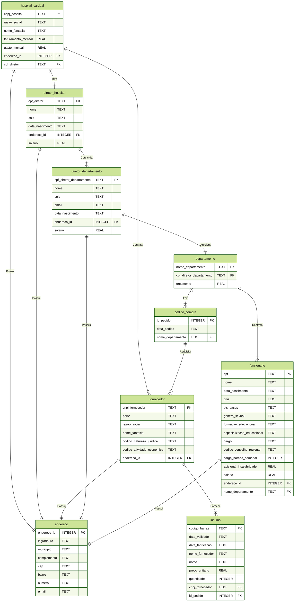

# EMR Diagram

```mermaid
---
config:
  theme: forest
---

erDiagram

endereco{
    
    endereco_id INTEGER PK
    logradouro TEXT
    municipio TEXT
    complemento TEXT
    cep TEXT
    bairro TEXT
    numero TEXT
    email TEXT
}

diretor_hospital{
    
    cpf_diretor TEXT PK
    nome TEXT
    cnis TEXT
    data_nascimento TEXT
    endereco_id INTEGER FK
    salario REAL
}

hospital_cardeal{ 
    
    cnpj_hospital TEXT PK
    razao_social TEXT
    nome_fantasia TEXT
    faturamento_mensal REAL
    gasto_mensal REAL
    endereco_id INTEGER FK
    cpf_diretor TEXT FK
}

fornecedor{ 
    
    cnpj_fornecedor TEXT PK
    porte TEXT
    razao_social TEXT
    nome_fantasia TEXT
    codigo_natureza_juridica TEXT
    codigo_atividade_economica TEXT
    endereco_id INTEGER FK
}

departamento{
    
    nome_departamento TEXT PK
    cpf_diretor_departamento TEXT FK
    orcamento REAL
}

diretor_departamento{
    
    cpf_diretor_departamento TEXT PK
    nome TEXT
    cnis TEXT
    email TEXT
    data_nascimento TEXT
    endereco_id INTEGER FK
    salario REAL
}

funcionario{
    
    cpf TEXT PK
    nome TEXT
    data_nascimento TEXT   
    cnis TEXT
    pis_pasep TEXT
    genero_sexual TEXT
    formacao_educacional TEXT
    especializacao_educacional TEXT
    cargo TEXT
    codigo_conselho_regional TEXT
    carga_horaria_semanal INTEGER
    adicional_insalubridade REAL
    salario REAL
    endereco_id INTEGER FK
    nome_departamento TEXT FK
}


insumo{
    
    codigo_barras TEXT PK
    data_validade TEXT
    data_fabricacao TEXT
    nome_fornecedor TEXT
    nome TEXT
    preco_unitario REAL
    quantidade INTEGER
    cnpj_fornecedor TEXT FK
    id_pedido INTEGER FK
}

pedido_compra{

    id_pedido INTEGER PK
    data_pedido TEXT
    nome_departamento TEXT FK
    
}

hospital_cardeal ||--|| diretor_hospital: Tem
hospital_cardeal ||--|{ fornecedor: Contrata
hospital_cardeal ||--|| endereco: Possui
diretor_hospital ||--|{ diretor_departamento: Comanda
diretor_hospital ||--|| endereco: Possui
fornecedor ||--|{ insumo: Fornece
fornecedor ||--|| endereco: Possui
diretor_departamento ||--|| departamento: Direciona
diretor_departamento ||--|| endereco: Possuir
departamento ||--|{ funcionario: Contrata
departamento ||--|{ pedido_compra: Faz
pedido_compra ||--|{ fornecedor: Requisita
funcionario ||--|| endereco: Possui
```