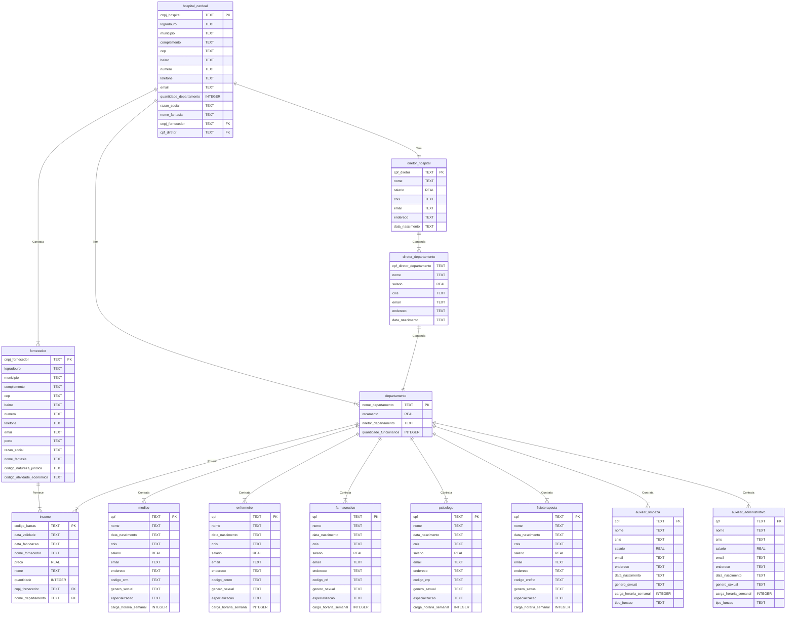

# EMR Diagram

```mermaid
erDiagram


hospital_cardeal{ 
    
    cnpj_hospital TEXT PK
    logradouro TEXT
    municipio TEXT
    complemento TEXT
    cep TEXT
    bairro TEXT
    numero TEXT
    telefone TEXT
    email TEXT
    quantidade_departamento INTEGER
    razao_social TEXT
    nome_fantasia TEXT
    cnpj_fornecedor TEXT FK
    cpf_diretor TEXT FK

}

fornecedor{ 
    
    cnpj_fornecedor TEXT PK
    logradouro TEXT
    municipio TEXT
    complemento TEXT
    cep TEXT
    bairro TEXT
    numero TEXT
    telefone TEXT
    email TEXT
    porte TEXT
    razao_social TEXT
    nome_fantasia TEXT
    codigo_natureza_juridica TEXT
    codigo_atividade_economica TEXT
 
}

diretor_hospital{
		
    cpf_diretor TEXT PK
    nome TEXT
    salario REAL
    cnis TEXT
    email TEXT
    endereco TEXT
	data_nascimento TEXT

}

departamento{
	
    nome_departamento TEXT PK
    orcamento REAL
    diretor_departamento TEXT
    quantidade_funcionarios INTEGER
		
}

diretor_departamento{
    
    cpf_diretor_departamento TEXT
    nome TEXT
    salario REAL
    cnis TEXT
    email TEXT
    endereco TEXT
    data_nascimento TEXT
    
}

medico{
    
    cpf TEXT PK
    nome TEXT
    data_nascimento TEXT   
    cnis TEXT
    salario REAL
    email TEXT
    endereco TEXT
    codigo_crm TEXT
    genero_sexual TEXT
    especializacao TEXT
    carga_horaria_semanal INTEGER
    
}

enfermeiro{ 
 
    cpf TEXT PK
    nome TEXT
    data_nascimento TEXT   
    cnis TEXT
    salario REAL
    email TEXT
    endereco TEXT
    codigo_coren TEXT
    genero_sexual TEXT
    especializacao TEXT
    carga_horaria_semanal INTEGER

}

farmaceutico{ 
 
    cpf TEXT PK
    nome TEXT
    data_nascimento TEXT   
    cnis TEXT
    salario REAL
    email TEXT
    endereco TEXT
    codigo_crf TEXT
    genero_sexual TEXT
    especializacao TEXT
    carga_horaria_semanal INTEGER

}

psicologo{ 
 
    cpf TEXT PK
    nome TEXT
    data_nascimento TEXT   
    cnis TEXT
    salario REAL
    email TEXT
    endereco TEXT
    codigo_crp TEXT
    genero_sexual TEXT
    especializacao TEXT
    carga_horaria_semanal INTEGER

}

fisioterapeuta{ 
 
    cpf TEXT PK
    nome TEXT
    data_nascimento TEXT   
    cnis TEXT
    salario REAL
    email TEXT
    endereco TEXT
    codigo_crefito TEXT
    genero_sexual TEXT
    especializacao TEXT
    carga_horaria_semanal INTEGER

}

auxiliar_limpeza{ 
 
    cpf TEXT PK
    nome TEXT
    cnis TEXT
    salario REAL
    email TEXT
    endereco TEXT
    data_nascimento TEXT
    genero_sexual TEXT
    carga_horaria_semanal INTEGER
    tipo_funcao TEXT

}

auxiliar_administrativo{ 
 
    cpf TEXT PK
    nome TEXT
    cnis TEXT
    salario REAL
    email TEXT
    endereco TEXT
    data_nascimento TEXT  
    genero_sexual TEXT
    carga_horaria_semanal INTEGER
    tipo_funcao TEXT

}

insumo{
    
    codigo_barras TEXT PK
    data_validade TEXT
    data_fabricacao TEXT
    nome_fornecedor TEXT
    preco REAL
    nome TEXT
    quantidade INTEGER
    cnpj_fornecedor TEXT FK
    nome_departamento TEXT FK
}

hospital_cardeal ||--|| diretor_hospital: Tem
hospital_cardeal ||--|{ departamento: Tem
hospital_cardeal ||--|{ fornecedor: Contrata
fornecedor ||--|{ insumo: Fornece
diretor_hospital ||--|{ diretor_departamento: Comanda
diretor_departamento ||--|| departamento: Comanda
departamento ||--|{ insumo: Possui
departamento ||--|{ medico: Contrata
departamento ||--|{ enfermeiro: Contrata
departamento ||--|{ farmaceutico: Contrata
departamento ||--|{ psicologo: Contrata
departamento ||--|{ fisioterapeuta: Contrata
departamento ||--|{ auxiliar_limpeza: Contrata
departamento ||--|{ auxiliar_administrativo: Contrata
```