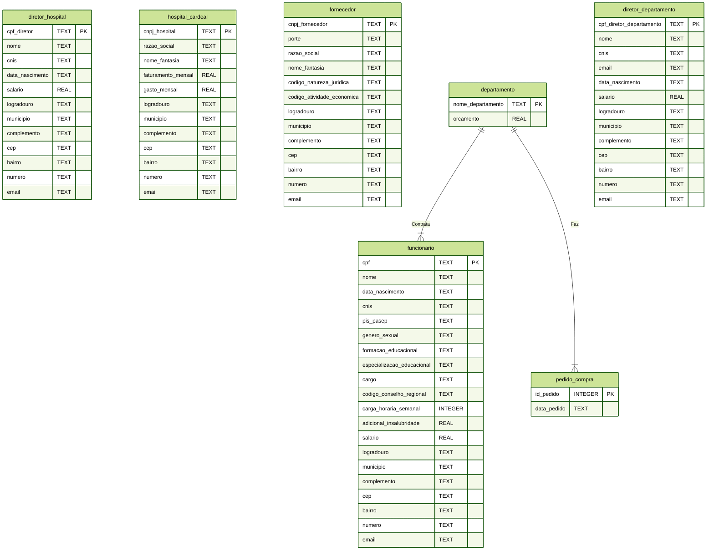

# EMR Diagram

```mermaid
---
config:
  theme: forest
---

erDiagram

diretor_hospital{
    
    cpf_diretor TEXT PK
    nome TEXT
    cnis TEXT
    data_nascimento TEXT
    salario REAL
    logradouro TEXT
    municipio TEXT
    complemento TEXT
    cep TEXT
    bairro TEXT
    numero TEXT
    email TEXT
}

hospital_cardeal{ 
    
    cnpj_hospital TEXT PK
    razao_social TEXT
    nome_fantasia TEXT
    faturamento_mensal REAL
    gasto_mensal REAL
    logradouro TEXT
    municipio TEXT
    complemento TEXT
    cep TEXT
    bairro TEXT
    numero TEXT
    email TEXT
}

fornecedor{ 
    
    cnpj_fornecedor TEXT PK
    porte TEXT
    razao_social TEXT
    nome_fantasia TEXT
    codigo_natureza_juridica TEXT
    codigo_atividade_economica TEXT
    logradouro TEXT
    municipio TEXT
    complemento TEXT
    cep TEXT
    bairro TEXT
    numero TEXT
    email TEXT
}

departamento{
    
    nome_departamento TEXT PK
    orcamento REAL
}

diretor_departamento{
    
    cpf_diretor_departamento TEXT PK
    nome TEXT
    cnis TEXT
    email TEXT
    data_nascimento TEXT
    salario REAL
    logradouro TEXT
    municipio TEXT
    complemento TEXT
    cep TEXT
    bairro TEXT
    numero TEXT
    email TEXT
}

funcionario{
    
    cpf TEXT PK
    nome TEXT
    data_nascimento TEXT   
    cnis TEXT
    pis_pasep TEXT
    genero_sexual TEXT
    formacao_educacional TEXT
    especializacao_educacional TEXT
    cargo TEXT
    codigo_conselho_regional TEXT
    carga_horaria_semanal INTEGER
    adicional_insalubridade REAL
    salario REAL
    logradouro TEXT
    municipio TEXT
    complemento TEXT
    cep TEXT
    bairro TEXT
    numero TEXT
    email TEXT
}

pedido_compra{

    id_pedido INTEGER PK
    data_pedido TEXT
    
}

departamento ||--|{ funcionario: Contrata
departamento ||--|{pedido_compra: Faz
```